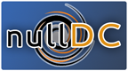
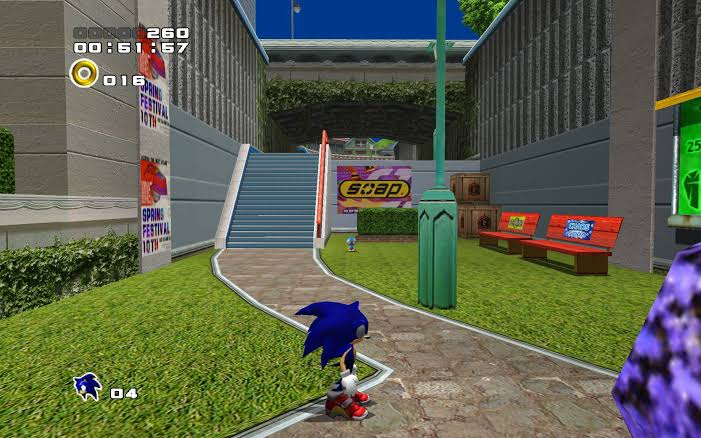
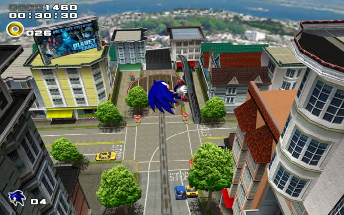
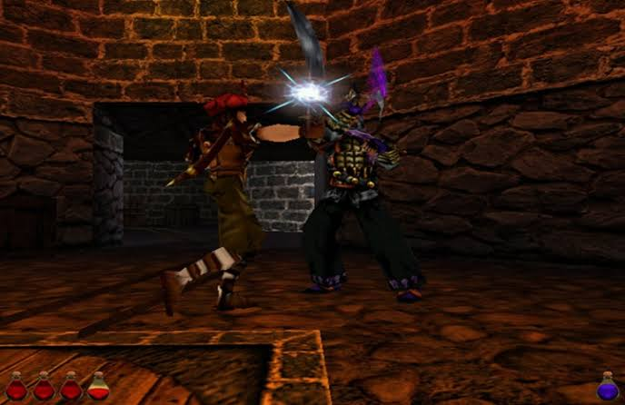
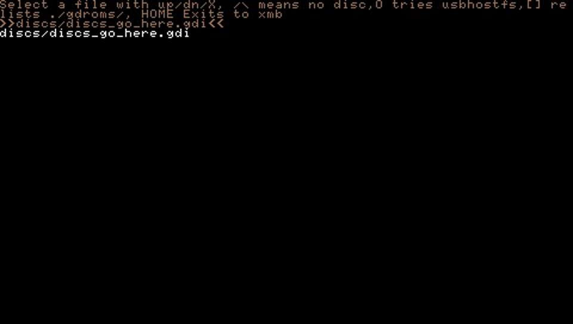

nullDCe-PSP is a Sega Dreamcast emulator for PlayStation Portable.

This is an experimental release, and many games are not yet playable.
future update Compatibility.

# Screenshot

- Sonic Adventure 1

- Sonic Adventure 2

- Prince of Persia 3D : Arabian Night

- Bomberman Online

# Authorship

nullDC-PSP was originally developed by drk||Raziel (currently under the nickname skmp). It was compiled and restored by xiro and hlide in 2021.

# Compatibility

nullDC-PSP is only compatible with 'slim' models (PSP-2000 and above). It will not boot on the original PSP-1000.

# Instructions

## BIOS files

The following files are needed in the `data` folder:

- dc_boot.bin
- dc_flash.bin

## Game files

Only games in the .gdi format are supported for now. Place the files for each individual game within a separate folder, and move the folder to `nullDC-PSP\discs`. The list of available games will then appear when you boot the emulator.

## Controls

Idle time can be adjusted with the L / R buttons.

To start the Dreamcast bios, press triangle as the emulator is booting.

# Notes

The on-screen frame rate is calculated through Vblank - which does not always correspond to the actual frame rate.
